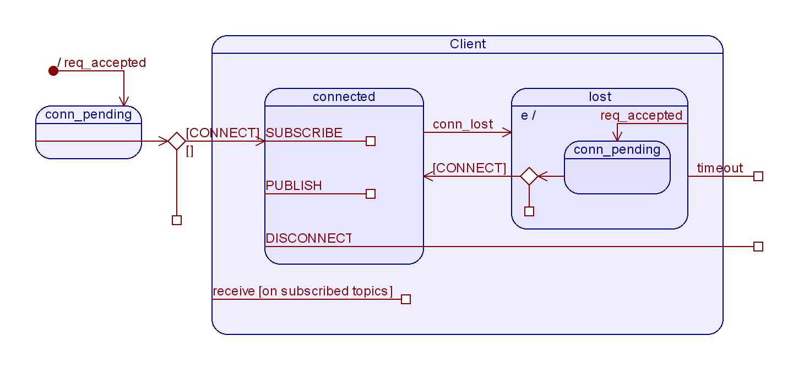

                             ____        __   _____       __   _  __                    
                            / __ \__  __/ /_ / ___/__  __/ /_ | |/ /                    
                           / /_/ / / / / __ \\__ \/ / / / __ \|   /                     
                          / ____/ /_/ / /_/ /__/ / /_/ / /_/ /   |                      
                         /_/    \__,_/_.___/____/\__,_/_.___/_/|_|                      
                                                                              

# Introduction
PubSubX is a framework for implementation of basic publish subscribe architecture
on TCP/IP layer written in Python. It consists of two modules: Server and client. 
Both modules are developed using raw sockets. 

Server application listens for TCP/IP requests on selected port and prints diagnostic 
informations (client subscribed to a topic...). It keeps track of all the clients
and their subscriptions and routes their messages accordingly. It also keeps track of lost clients (that have disconnected abruptly) and messages sent to them for a certain period (default 60 seconds) 
Since it uses efficient Linux I/O event notification facility Epoll it can be only run on Linux OS.

Client application connects to the server and is used to interact with it and other 
clients (publish and receive messages). It is platform independent. 
It implements next set of commands
- CONNECT     \<port>  \<name>  - Connects to a server at port, with name 
- DISCONNECT                    - Disconnects from server
- PUBLISH     \<topic> \<data>  - Sends (ASCII) message on a topic 
- SUBSCRIBE   \<topic>          - Client subscribes to a topic
- UNSUBSCRIBE \<topic>          - Client unsubscribes from a topic


---------------------------------------------------------------------------
# Usage

Server module must be started with port number as argument:
```
PubSubX $python3 server.py 12000
INFO: Server successfully started
```

Client is started with no arguments after which prompt text to enter command is printed. First command that must be entered is CONNECT with appropriate server port number and client name.
```
PubSubX $python3 client.py
Enter command or (-h): connect 12000 homer
INFO: Connection successfully established
```
Information about all possible commands is given when -h is entered.

Link to the usage video is given bellow


[](https://youtu.be/FFdY0LcWPZg>)


---------------------------------------------------------------------------
# Server module
Server module consists of 2 classes, client and server.  
Client class is helper class for server's client "accounting". Server class uses 
efficient Linux I/O event notification facility Epoll. Since this is Linux-only 
facility this module cannot be used on other platforms. Epool is used to implement
efficient non blocking control of multiple connections between clients and server.
Simplified state machine of a single client in a server application is shown 
on next picture:

<p align="center">
  
</p>


---------------------------------------------------------------------------
# Client module
Client module consists of 1 class - client. Client class uses portable select 
mechanism for nonblocking overview of input and output sockets for external 
and inter-thread communication. Client has 2 loops, one for command line interface 
for issuing commands and other for socket monitoring and communication with server. 
These 2 loops communicate via sockets, command loop sends messages over to socket loop.
